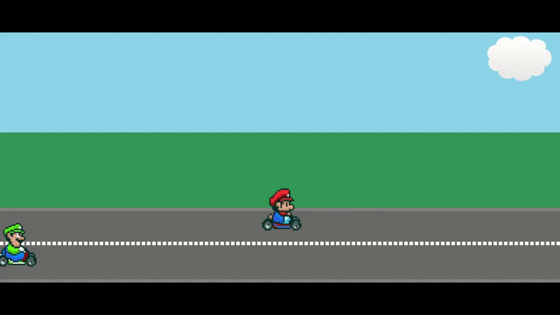

[](https://www.linkedin.com/in/mohamednaseramein/)

# Mario Game

A simple Demo for Using CSS animation stuff (Transforms , Key-forms , Transitions ).

## Authors

This project was executed by the duo of :

- [Mohamed Naser](https://www.linkedin.com/in/mohamednaseramein/)

## Used Tools

- HTML
- CSS
- Tranforms
- Keyforms
- Transitions

## Setup

Open your git bash and cd to the location you'd like to put your files the run the command below.

```console
git clone https://github.com/mohamednaser/mario-game-with-css-only.git
```

## Live Version

Live version [here](https://mohamednaser.github.io/mario-game-with-css-only/)

## Demo


